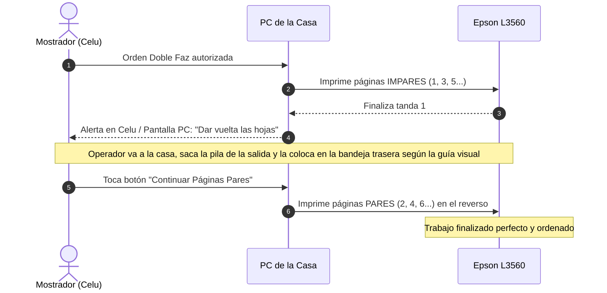

# Propuesta Integral: Sistema de Impresiones para Kiosco "El Tato"

> **Estado del documento:** Propuesta preliminar refinada (sujeta a ajustes del usuario).  
> **Metodología aplicada:** `/interview-me` + `/idea-refine`.

---

## 1. Declaración del Problema (Problem Statement)

> **¿Cómo podríamos** permitir que una persona que atiende sola en el mostrador de un kiosco familiar cotice al instante, cobre y mande a imprimir documentos o fotos a una Epson L3560 ubicada en la casa, usando solo su celular por Wi-Fi y sin requerir conocimientos técnicos ni abrir programas complejos?

---

## 2. Los 3 Pilares del Diseño

1. **Fricción Cero para la Familia (Mamá / Papá / Hermano):**
   - No descargan programas ni configuran propiedades de impresión en Windows.
   - No hacen cálculos mentales de precios (la app les muestra el total en números gigantes).
   - Tienen un solo botón de acción: **[ COBRAR E IMPRIMIR ]**.
2. **Cero Desperdicio y Seguridad de Cobro:**
   - La impresora física **nunca se activa** antes de que quien atienda en el mostrador confirme el cobro.
   - Protección total contra spam, archivos de 200 hojas accidentales o clientes que se arrepienten sin pagar.
3. **Flujo Natural para el Cliente de Barrio:**
   - El cliente sigue enviando sus archivos al **WhatsApp de siempre del negocio**. No se le obliga a registrarse, escanear QR ni descargar apps raras.

---

## 3. Arquitectura del Sistema Propuesto

El sistema se compone de dos partes conectadas mediante la red Wi-Fi local del hogar/kiosco:

```mermaid
flowchart TD
    subgraph Kiosco ["Mostrador del Kiosco (1 Persona)"]
        Cliente["Cliente (WhatsApp)"] -->|Envía PDF o Foto| Celu["Celular del Kiosco"]
        Celu -->|1. Abre archivo / Comparte a Web| AppWeb["App Web Local / PWA\n(Cotizador en 1 toque)"]
        AppWeb -->|2. Muestra: TOTAL $600| Operador["Mamá / Papá / Vos\n(Cobra la plata)"]
        Operador -->|3. Toca: [ENVIAR A IMPRIMIR]| AppWeb
    end

    subgraph RedLocal ["Red Wi-Fi Local"]
        AppWeb -->|Orden de impresión por Wi-Fi| ServidorPC["Agente de Impresión Local\n(En PC de la casa)"]
    end

    subgraph Casa ["Casa (Dentro)"]
        ServidorPC -->|Manda trabajo con parámetros listos| Epson["Epson EcoTank L3560"]
        Epson -->|Imprime hojas| Bandeja["Bandeja de Salida"]
        Operador -.->|Camina a retirar hojas listas| Bandeja
    end
```

### Componente 1: La App Web Móvil de Mostrador (PWA)
- Corre en el navegador del celular (Chrome/Safari) y se instala como un ícono de app en la pantalla de inicio.
- **Funcionalidad:**
  - Botón grande **"Cargar archivo"** (o compartir directo desde WhatsApp).
  - Lee los metadatos del archivo en 1 segundo: número de páginas del PDF o resolución de la foto.
  - Opciones rápidas con un toque:
    - `[ Blanco y Negro ]` vs `[ Color ]`
    - `[ Simple Faz ]` vs `[ Doble Faz ]`
    - `[ Papel Normal ]` vs `[ Papel Fotográfico ]` (para fotos)
  - Muestra en pantalla gigante: **TOTAL A COBRAR: $X.XXX**.
  - Botón verde: **`[ COBRAR Y MANDAR A IMPRIMIR ]`**.

### Componente 2: El Agente de Impresión en la PC de la Casa
- Un servicio ultra-liviano (ej. Node.js o Python) que se ejecuta silenciosamente en segundo plano en la PC de la casa al encenderla.
- Recibe la orden enviada por la Web App del celular a través del Wi-Fi local.
- Utiliza las utilidades nativas de Windows / drivers de Epson para mandar el trabajo a imprimir en silencio, con la orientación, calidad y márgenes correctos.

---

## 4. Solución al Desafío del Dúplex Manual (Epson L3560)

Dado que la **Epson EcoTank L3560 cuenta con bandeja de carga trasera y NO tiene volteador automático de papel**, imprimir doble faz a mano suele provocar hojas impresas al revés, en orden invertido o atascadas.

### El Flujo de Dúplex Asistido:



> 💡 *Se generó una guía paso a paso específica para la bandeja trasera de la Epson L3560 en [guia-duplex-l3560.md](docs/guia-duplex-l3560.md).*

---

## 5. Manejo de Fotos

Las fotos recibidas por WhatsApp tienen dos problemas típicos: suelen venir en proporciones variadas y consumen mucha tinta si se imprimen sin control de calidad.

El sistema resolverá esto con plantillas predefinidas:
1. **Foto A4 (Hoja Completa):** Ajuste inteligente para no cortar bordes críticos.
2. **Foto 10x15 cm (Típica foto de marco/álbum):** Centrada en papel A4 o en papel 10x15 fotográfico.
3. **Modo DNI / Documento:** Si mandan 2 fotos (frente y dorso del DNI), el sistema las ubica automáticamente una al lado de la otra en una sola carilla A4.

---

## 6. Alcance del MVP (Producto Mínimo Viable)

### ✅ Lo que SÍ incluye:
- [x] Pantalla móvil ultra simple para el celular del mostrador (diseñada para uso con 1 dedo).
- [x] Conteo automático de páginas para documentos PDF.
- [x] Selector instantáneo: B&N / Color / Simple / Doble Faz.
- [x] Calculadora automática de precio final configurable (panel de ajustes para cambiar precios cuando haya inflación).
- [x] Botón de autorización obligatoria antes de disparar la impresión.
- [x] Servicio de comunicación local por Wi-Fi entre el celular y la PC de la casa.
- [x] Asistente guiado para doble faz en la Epson L3560.

### ❌ Lo que explícitamente NO incluye (Out of Scope) y por qué:
- **No habrá bots no oficiales de WhatsApp:** Evita el riesgo de suspensión de la cuenta del kiosco y fallas continuas de sesión.
- **No habrá pasarelas de pago online con tarjeta/comisiones:** El cobro es presencial en efectivo o con el QR de Mercado Pago del mostrador.
- **No habrá cuentas de usuario para clientes:** Los clientes no se registran ni crean perfiles; son vecinos que se atienden al paso.
- **No habrá almacenamiento eterno de archivos:** Los archivos impresos se purgan automáticamente al finalizar el día para no llenar el disco de la PC ni comprometer la privacidad del cliente.

---

## 7. Supuestos a Validar en las Primeras Pruebas

1. **Cobertura de Wi-Fi:** Comprobar que el celular del mostrador tiene señal Wi-Fi estable con el router que conecta la PC de la casa.
2. **Tiempo de respuesta:** Asegurar que desde que se presiona "Mandar a Imprimir" en el celular, la Epson responde en menos de 5 segundos.
3. **Facilidad de adopción familiar:** Probar la pantalla de cobro con la madre o el padre y verificar que no les genere dudas ni vacilaciones.

---

## 8. Preguntas Abiertas para la Siguiente Etapa

1. ¿Cuáles son los precios estimados por hoja que tienen pensado cobrar (ej: B&N simple, B&N doble, Color, Foto)?
2. En la PC de la casa con Windows, ¿la Epson L3560 está conectada por cable USB o por Wi-Fi a la PC? *(Recomendado: USB a la PC para máxima estabilidad si la PC está al lado).*

