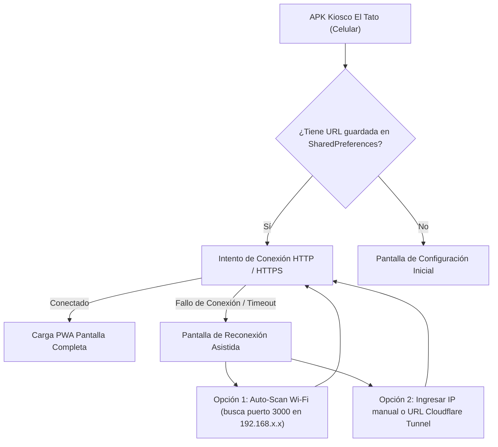

# Plan de Arquitectura e Implementación: APK Android Web Shell Liviano — Kiosco "El Tato"

## 1. Visión General del Proyecto
Crear una aplicación Android nativa ultra liviana (**< 3 MB**) de alto rendimiento basada en **Android WebView** (Web Shell) optimizada para el mostrador del kiosco. La app envolverá la PWA del sistema de impresión, permitiendo operar con fluidez táctil, soporte de cámara y selector de archivos, garantizando conexión permanente con la PC del servidor tanto por **red Wi-Fi local (LAN)** como por **túnel Cloudflare (`cloudflared`)** sin requerir dominios pagos.

---

## 2. Análisis del Entorno de Desarrollo Local
- **JDK:** Java 17 HotSpot instalado (`C:\Program Files\Microsoft\jdk-17.0.19.10-hotspot`).
- **Android SDK:** Instalado en `%LOCALAPPDATA%\Android\Sdk` con API Platforms 34 (`android-34`) y Build-Tools `34.0.0` y `35.0.0`.
- **Binario Cloudflare:** `cloudflared.exe` disponible para túneles zero-config.

---

## 3. Arquitectura de Conectividad y Resiliencia (Dual-Mode)

### Modos de Enlace Soportados por el APK:
1. **Modo Directo LAN (Recomendado para el mostrador):**
   - Conexión directa a `http://<IP-LOCAL-PC>:3000`.
   - **Ventajas:** Latencia 0 ms, ultra rápida, funciona 100% offline (sin internet hacia afuera, solo Wi-Fi interno del router).
   - Requiere `android:usesCleartextTraffic="true"` en `AndroidManifest.xml` (soportado para Android 9+).
2. **Modo Túnel Cloudflare (`cloudflared` Quick Tunnel):**
   - Comando en PC: `.\cloudflared.exe tunnel --url http://localhost:3000`
   - Genera una URL pública segura: `https://[subdominio-aleatorio].trycloudflare.com`.
   - **Ventajas:** No requiere abrir puertos en el router, funciona con datos móviles fuera del local, no requiere comprar dominio ni pagar nada.

---

## 4. Requisitos Nativos del APK Android (WebView Shell)

| Capacidad | Implementación | Propósito |
| :--- | :--- | :--- |
| **Peso Ultra Liviano** | Android WebView nativo en Kotlin/Java | Tamaño final **~2.5 MB** (frente a 30-50 MB de frameworks híbridos). |
| **Compatibilidad** | `minSdkVersion 21` (Android 5.0) a `targetSdkVersion 34` (Android 14) | Corre en cualquier teléfono antiguo o moderno del mostrador. |
| **Selector de Archivos** | `WebChromeClient.onShowFileChooser` | Permite que al tocar "Subir archivo" o "+ Otra foto" abra la cámara y la galería nativas. |
| **Permisos de Cámara y Archivos** | `CAMERA`, `READ_EXTERNAL_STORAGE`, `READ_MEDIA_IMAGES` | Carga fluida de documentos y fotos para imprimir. |
| **Manejo de Desconexión** | `WebViewClient.onReceivedError` | Muestra pantalla amigable con botón de reintentar y selector de IP en vez del error feo de Chromium. |
| **Navegación Táctil** | Botón atrás físico integrado (`onBackPressedDispatcher`) | El botón atrás del teléfono vuelve a la pantalla previa de la app web sin cerrarla accidentalmente. |
| **Pantalla Completa** | Barra de estado inmersiva con colores corporativos del kiosco | Aspecto de app nativa instalada, sin barras de navegador que distraigan. |

---

## 5. Automatización de Compilación en Windows
- Se creará el proyecto en `android/`.
- Se creará un script batch `compilar-apk.bat` que use el Gradle Wrapper y el SDK local para generar `KioscoElTato-release.apk` en un solo clic.
